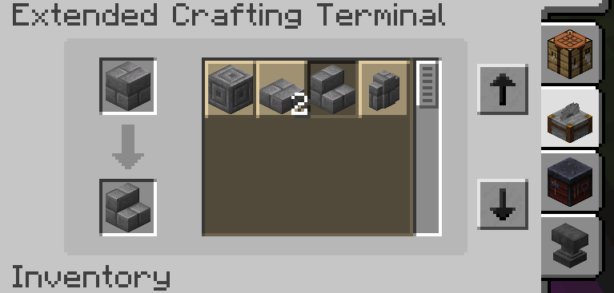

---
navigation:
    parent: epp_intro/epp_intro-index.md
    title: Terminal de fabricación ME extendida
    icon: expatternprovider:ex_crafting_terminal
categories:
- extended devices
item_ids:
- expatternprovider:ex_crafting_terminal
---

# Terminal de fabricación ME extendida

La terminal de fabricación ME extendida agrega funciones de cortapiedras, mesa de herrería y yunque a la <ItemLink id="ae2:crafting_terminal" />.

<Row gap="20">
<GameScene zoom="6" background="transparent">
<ImportStructure src="../structure/cable_ex_crafting_terminal.snbt"></ImportStructure>
<IsometricCamera yaw="180"></IsometricCamera>
</GameScene>
</Row>

## Recetas adicionales

Puedes usar la terminal de fabricación extendida como cortapiedras, mesa de herrería y yunque, usa el botón de pestaña para cambiar de modo.

El modo de yunque puede usar XP líquido de otros mods almacenados en la red ME cuando no tienes suficientes niveles.

