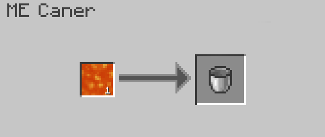
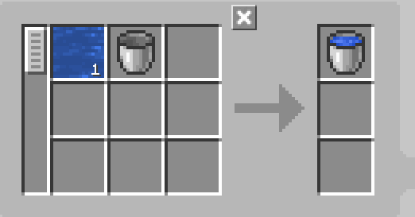
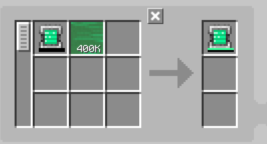

---
navigation:
    parent: epp_intro/epp_intro-index.md
    title: ME Caner
    icon: expatternprovider:caner
categories:
- extended devices
item_ids:
- expatternprovider:caner
---

# ME Caner

<BlockImage id="expatternprovider:caner" scale="8"></BlockImage>

The ME Caner is a machine that cans resources, including fluids, Mekanism gas, Botania mana, and even energy!

The first slot is for what to fill with, and the second slot is for what should be filled.

It needs energy to run and every operation costs 80 AE.

It only fills fluids by default. You need to install the corresponding addon to make it fill other resources.

### Supported Addons:
- Applied Flux
- Applied Mekanistics
- Applied Botanics Addon

## Autocrafting with ME Caner

Only the top and bottom sides can accept energy and connect to the network.

<GameScene zoom="6" background="transparent">
  <ImportStructure src="../structure/caner_example.snbt"></ImportStructure>
</GameScene>

A simple setup for the ME Caner. The ME Caner will automatically eject the filled item when it accepts the ingredients from <ItemLink id="ae2:pattern_provider" />.

<GameScene zoom="6" background="transparent">
  <ImportStructure src="../structure/caner_auto.snbt"></ImportStructure>
</GameScene>

The pattern must only contain the resource to fill with and the container to be filled. Here are some examples:

Fill a water bucket:

Charge an Energy Tablet (requires Applied Flux):

## Uncanning

The ME Caner can also drain resources from containers in Empty mode. You need to switch the inputs and outputs in the pattern.
