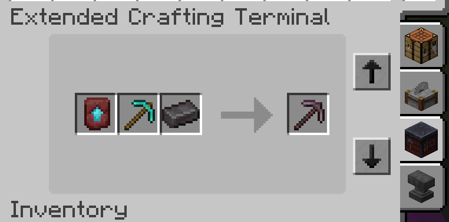
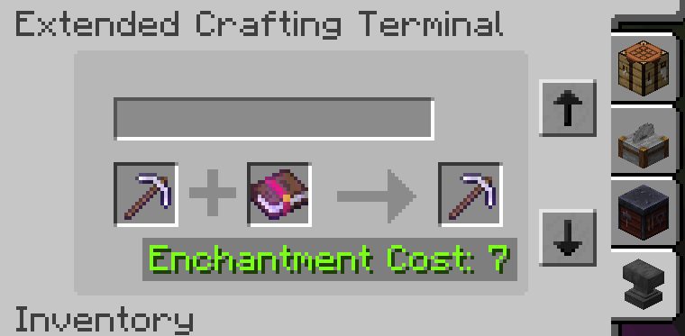

---
navigation:
    parent: epp_intro/epp_intro-index.md
    title: ME Extended Crafting Terminal
    icon: expatternprovider:ex_crafting_terminal
categories:
- extended devices
item_ids:
- expatternprovider:ex_crafting_terminal
---

# ME Extended Crafting Terminal

ME Extended Crafting Terminal adds Stonecutter, Smithing Table and Anvil features to <ItemLink id="ae2:crafting_terminal" />.

<Row gap="20">
<GameScene zoom="6" background="transparent">
<ImportStructure src="../structure/cable_ex_crafting_terminal.snbt"></ImportStructure>
<IsometricCamera yaw="180"></IsometricCamera>
</GameScene>
</Row>

## Extra recipes

You can use Extended Crafting Terminal as a Stonecutter, Smithing Table and Anvil, use the tab button to change mode.

Anvil mode can use liquid XP from other mods stored in ME network when you don't have enough levels.

