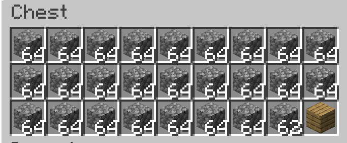

---
navigation:
    parent: epp_intro/epp_intro-index.md
    title: ME Precise Export Bus
    icon: expatternprovider:precise_export_bus
categories:
- extended devices
item_ids:
- expatternprovider:precise_export_bus
---

# ME Precise Export Bus

<GameScene zoom="8" background="transparent">
  <ImportStructure src="../structure/cable_precise_export_bus.snbt"></ImportStructure>
</GameScene>

The ME Precise Export Bus exports items/fluids in specified quantities. It only exports if the container can fully accept the entire output.

## Example

This means exporting 3 cobblestone per operation. It stops exporting when the amount of cobblestone in the network is lower than 3.

It also stops exporting when the target container can't hold the full output. The chest can only hold 2 more cobblestone now, so the export bus stops.
