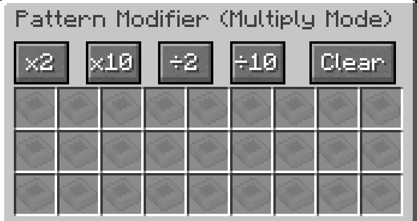
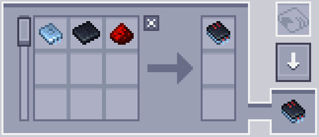
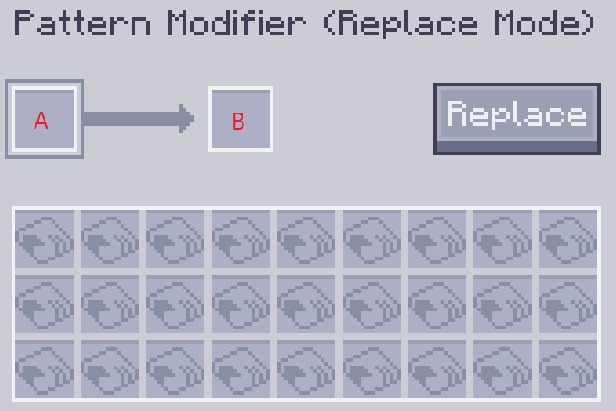
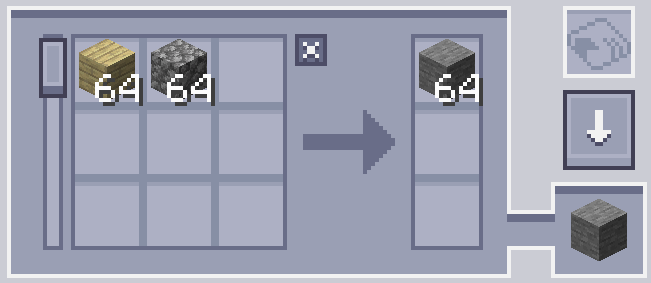
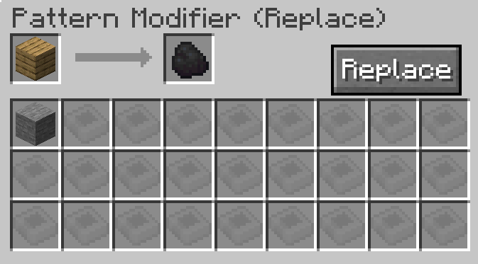
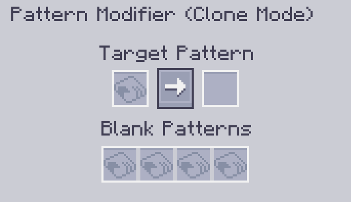

---
navigation:
    parent: epp_intro/epp_intro-index.md
    title: Pattern Modifier
    icon: extendedae:pattern_modifier
categories:
- extended items
item_ids:
- extendedae:pattern_modifier
---

# Pattern Modifier

Pattern Modifier is a tool for bulk pattern modifications.

<ItemImage id="extendedae:pattern_modifier" scale="4"></ItemImage>

Right-click it to open its GUI.

## Multiply Mode

You can multiply or divide a processing pattern's input and output quantities by a factor of x by clicking the corresponding button.

Original Pattern:

After ×10:

It can also clear the contents of all patterns and turn them into blank patterns by clicking the Clear button.

### Notes

 - The division button only works when the relevant amount is evenly divisible. For example, the ÷2 button will not work when a pattern requires 3
 cobblestones as input, because 3 ÷ 2 is 1.5.

 - The multiplication button has a cap of 999999. It cannot increase a single ingredient's amount beyond this number.

## Replace Mode

Replace a specific input or output ingredient in a pattern with another item.

Slot A is the item to be replaced, and slot B is the replacement item.

For example, the following setting will replace the plank with coal.

Click the Replace button to perform the replacement.

## Property Mode

Modify a crafting pattern's Substitutions and Fluid Substitutions modes.

## Clone Mode

You can make a copy of any given pattern in this mode.

