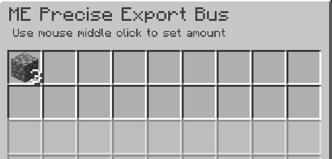

---
navigation:
    parent: epp_intro/epp_intro-index.md
    title: ME Precise Export Bus
    icon: extendedae:precise_export_bus
categories:
- extended devices
item_ids:
- extendedae:precise_export_bus
---

# ME Precise Export Bus

<GameScene zoom="8" background="transparent">
  <ImportStructure src="../structure/cable_precise_export_bus.snbt"></ImportStructure>
</GameScene>

ME Precise Export Bus exports items or fluids in specified quantities. It only exports if the container can fully accept the entire output.

## Example

This exports 3 cobblestones per operation. It stops exporting when the amount of cobblestone in the network is less than 3.

It also stops exporting when the target container cannot hold the entire output. The chest can hold only 2 more cobblestones, so the export bus stops.
