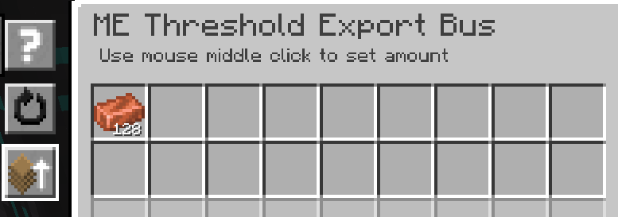

---
navigation:
    parent: epp_intro/epp_intro-index.md
    title: ME Threshold Export Bus
    icon: extendedae:threshold_export_bus
categories:
- extended devices
item_ids:
- extendedae:threshold_export_bus
---

# ME Threshold Export Bus

<GameScene zoom="8" background="transparent">
  <ImportStructure src="../structure/cable_threshold_export_bus.snbt"></ImportStructure>
</GameScene>

The ME Threshold Export Bus operates when the quantity of an item stored in the ME network is above or below the threshold.

## Example

The copper threshold is set to 128, so the bus exports copper when the network stores more than 128.

The threshold is the same as above, but the mode is set to BELOW. The bus exports copper when the network stores less than 128.
