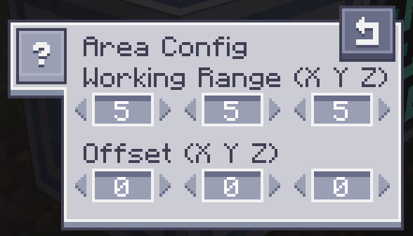
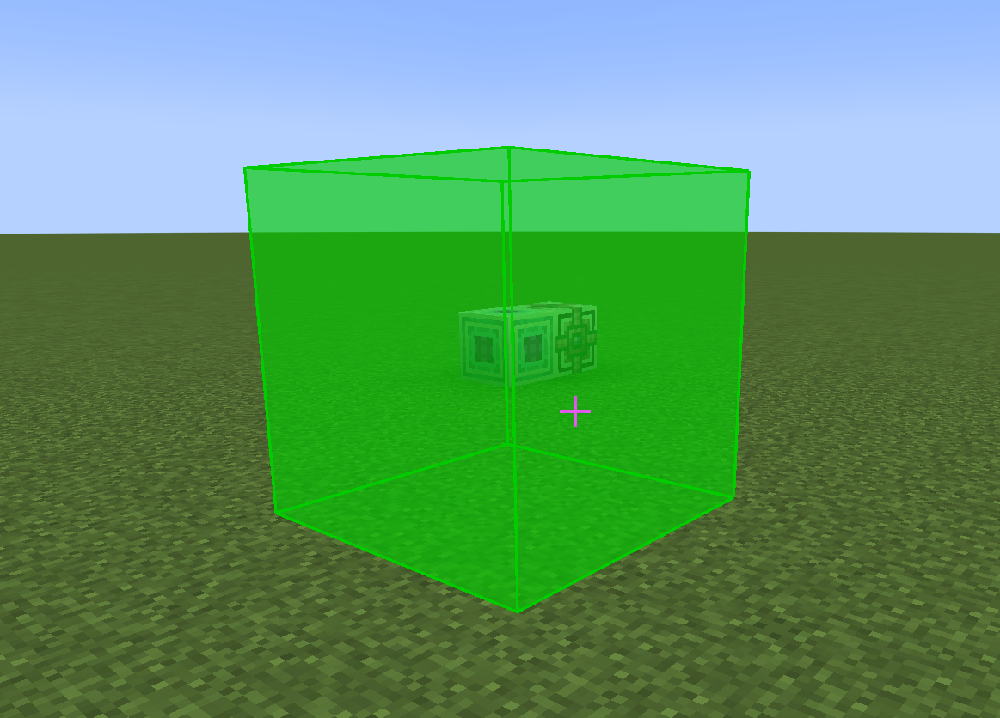

---
navigation:
    parent: epp_intro/epp_intro-index.md
    title: ME Vacuum Interface
    icon: extendedae:vacuum_interface
categories:
- extended devices
item_ids:
- extendedae:vacuum_interface
---

# ME Vacuum Interface

<Row>
<BlockImage id="extendedae:vacuum_interface" scale="8"></BlockImage>
</Row>

ME Vacuum Interface automatically collects dropped items within its working area and inserts them directly into the
connected ME network. Items that the network cannot accept remain in the world.

## Working Area

The default working area is 5 x 5 x 5 blocks and is centered on the interface. Use the Area Config button to adjust its
size and offset on each axis. Each dimension can be up to 10 blocks, and the area can be offset by up to 16 blocks.

The Show Working Area button displays the configured area in the world.
